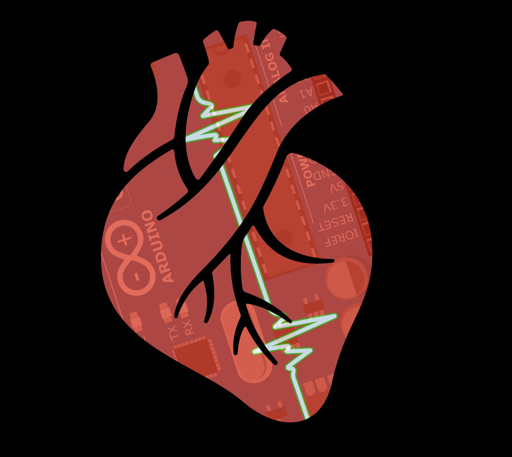

# HR-Sim

  

A cross platform script for artifical cardiac triggering.

## Features
* Compatible with devices that take a 5V input via RCA plug
* Script written in both MATLAB and Python.
* Automatically write and save output compatible file for Arduino Uno(.INO) after running the main script.
* Upload the .INO to the Ardunio via USB using the Arduino IDE.

## Parts and Required Software
* [Open-Source Arduino IDE](https://www.arduino.cc/en/Main/Software)
* [Arduino Uno](https://www.digikey.com/product-detail/en/arduino/A000073/1050-1041-ND/3476357)
* [BNC Connector - Right Angle](https://www.digikey.com/product-detail/en/molex-llc/0731375003/WM5514-ND/1465136)
* [USB Cable A to B - 6 Feet](https://www.digikey.com/product-detail/en/molex/0887329400/WM17134-ND/1212447)
* [25 feet RCA male - BNC female Cable](https://www.cablewholesale.com/specs/11x1-02125.php?utm_source=GoogleShopping&utm_medium=cpc&utm_term=11X1-02125&utm_campaign=RG59U%20Coaxial%20BNC%20to%20RCA%20Video%20Cable%2C%20Black%2C%20BNC%20Male%20to%20RCA%20Male%2C%2075%20Ohm%2C%2064%25%20Braid%2C%2025%20foot&gclid=EAIaIQobChMI_43148Hg3AIVjddkCh0vIwsJEAkYASABEgIqovD_BwE)

## Instructions

Attachting BNC Connector to Arduino
* Place ground lead (silver wire) into pin labeled GND on the digital side of the Arduino Uno.
* Place hot lead (gold wire) into pin labeled 13 on the digital side of the Arduino Uno.

Running the Script
* Set input directory. Figures ("Guassian Distribution of Heart Beat Times" and "Trigger to Scanner"), Arduino Unio Files (.INO), and a spreadsheet key will be generated in a folder within this directory.
* Set desired number of beats to generate.
* Set desired number of beats to skip (useful for systems with systems that are prone to ECG interference i.e. MRI).
* Set desired mean R-R interval (in milliseconds).
* Set desired standard deviation of R-R interval (in milliseconds).
* The rest of the code is fully automaded from here.

